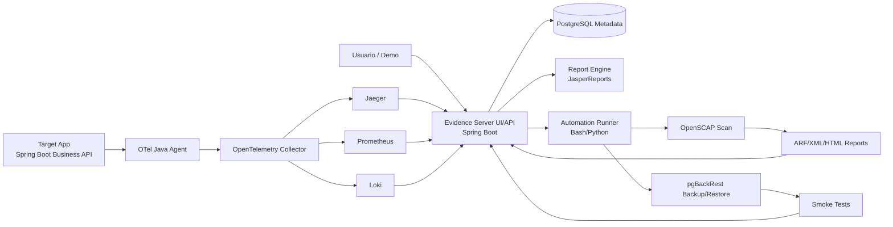
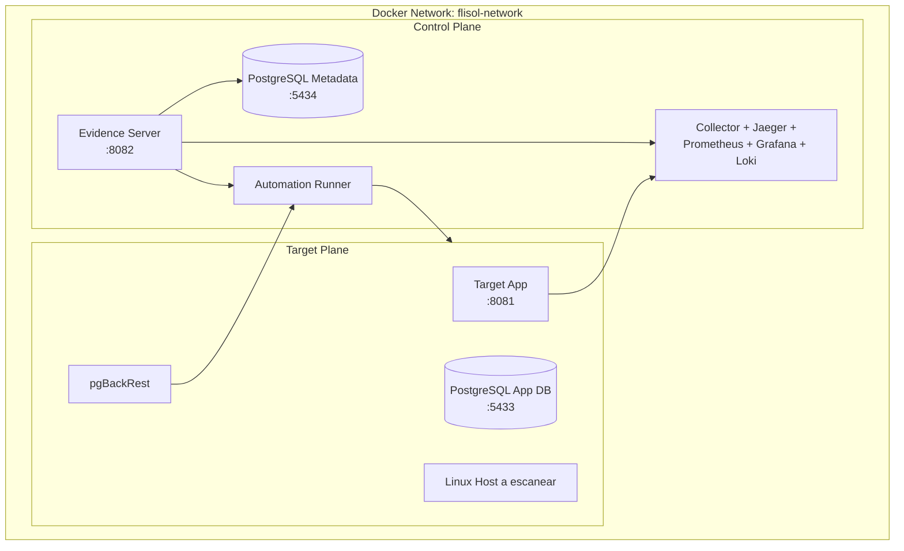
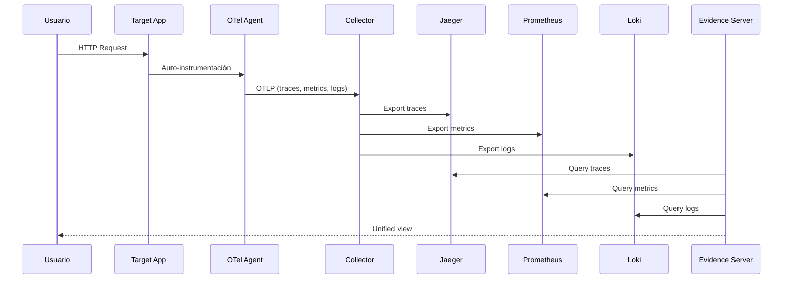

# FLISOL Evidence as Code

[](https://opensource.org/licenses/MIT)
[](https://www.docker.com/)
[](https://spring.io/projects/spring-boot)
[](https://openjdk.org/projects/jdk/21/)

## 🎯 Propósito

**Evidence as Code** es una plataforma libre que demuestra, con evidencia verificable, tres capacidades sobre un servicio Linux real:

1. **Observabilidad:** Ver qué pasó en una petición, cuánto tardó y dónde falló
2. **Cumplimiento:** Medir si el host cumple estándares de seguridad (CIS Benchmarks)
3. **Recuperación:** Demostrar que la base de datos sí se recupera ante fallos

La plataforma genera artefactos claros y verificables:
- Trazas distribuidas
- Métricas temporales
- Logs correlacionados
- Reportes de cumplimiento
- Historial de backups
- Pruebas de restore verificadas
- Reportes PDF ejecutivos

---

## 🏗️ Arquitectura del Sistema

### Arquitectura Lógica



### Arquitectura Física



### Flujo de Datos de Observabilidad



---

## 🛠️ Stack Tecnológico

### Aplicaciones

| Componente | Versión | Rol | Puerto |
|-----------|--------|-----|--------|
| **Spring Boot** | 4.0.5 | Framework principal | - |
| **Java** | 21 | Lenguaje principal | - |
| **Target App** | 0.1.0 | Aplicación de negocio | 8081 |
| **Evidence Server** | 0.1.0 | Servidor de evidencia | 8082 |

### Bases de Datos

| Componente | Versión | Rol | Puerto |
|-----------|--------|-----|--------|
| **PostgreSQL** | 18.3 | Base de datos principal | - |
| **App DB** | 18.3 | Datos funcionales | 5433 |
| **Metadata DB** | 18.3 | Evidencia y metadatos | 5434 |

### Observabilidad

| Componente | Versión | Rol | Puerto |
|-----------|--------|-----|--------|
| **OpenTelemetry Java Agent** | 2.26.1 | Instrumentación automática | - |
| **OpenTelemetry Collector** | v0.150.0 | Pipeline de telemetría | 4318 |
| **Jaeger** | 2.17.0 | Trazas distribuidas | 16686 |
| **Prometheus** | 3.11.2 | Métricas temporales | 9090 |
| **Grafana** | 12.4 | Dashboards visuales | 3000 |
| **Loki** | 3.7.0 | Logs centralizados | 3100 |
| **Grafana Alloy** | 1.15.0 | Envío de logs | - |

### Seguridad y Cumplimiento

| Componente | Versión | Rol | - |
|-----------|--------|-----|---|
| **OpenSCAP** | 1.4.3 | Evaluación de seguridad | - |
| **ComplianceAsCode** | 0.1.80 | Contenido de perfiles CIS | - |

### Backup y Recuperación

| Componente | Versión | Rol | - |
|-----------|--------|-----|---|
| **pgBackRest** | 2.58.0 | Backup/restore PostgreSQL | - |

### Reportes

| Componente | Versión | Rol | - |
|-----------|--------|-----|---|
| **JasperReports** | 7.0.6 | Generación de PDFs | - |

### Orquestación

| Componente | Versión | Rol | - |
|-----------|--------|-----|---|
| **Docker Compose** | 5.1.2 | Orquestación de contenedores | - |

---

## 📁 Estructura del Repositorio

```text
flisol-evidence-as-code/
├── README.md                          # Este archivo
├── manual_flisol_evidence_as_code.md  # Manual técnico detallado
├── compose/                           # Configuración Docker Compose
│   ├── docker-compose.yml            # Orquestación principal
│   ├── .env.example                   # Variables de entorno ejemplo
│   ├── collector/                     # Configuración OpenTelemetry Collector
│   │   └── otel-collector-config.yaml
│   ├── prometheus/                    # Configuración Prometheus
│   │   └── prometheus.yml
│   ├── grafana/                       # Configuración Grafana
│   │   ├── provisioning/
│   │   └── dashboards/
│   ├── loki/                          # Configuración Loki
│   │   └── loki-config.yaml
│   └── alloy/                         # Configuración Alloy
│       └── config.alloy
├── apps/                              # Aplicaciones Spring Boot
│   ├── target-app/                    # Aplicación de negocio
│   │   ├── src/
│   │   │   └── main/
│   │   │       ├── java/org/flisol/targetapp/
│   │   │       │   ├── TargetAppApplication.java
│   │   │       │   ├── web/
│   │   │       │   │   ├── OrderController.java
│   │   │       │   │   └── HealthInfoController.java
│   │   │       │   └── domain/
│   │   │       │       └── Order.java
│   │   │       └── resources/
│   │   │           ├── application.yml
│   │   │           └── static/
│   │   ├── pom.xml
│   │   └── Dockerfile
│   └── evidence-server/               # Servidor de evidencia
│       ├── src/
│       │   └── main/
│       │       ├── java/org/flisol/evidence/
│       │       │   ├── EvidenceServerApplication.java
│       │       │   ├── domain/
│       │       │   │   ├── Host.java
│       │       │   │   ├── ComplianceScan.java
│       │       │   │   ├── BackupRun.java
│       │       │   │   ├── RestoreRun.java
│       │       │   │   └── ReportJob.java
│       │       │   ├── read/
│       │       │   │   └── EvidenceReadService.java
│       │       │   ├── report/
│       │       │   │   └── ReportService.java
│       │       │   └── web/
│       │       │       ├── DashboardController.java
│       │       │       ├── DashboardApiController.java
│       │       │       ├── ActionController.java
│       │       │       └── HealthInfoController.java
│       │       └── resources/
│       │           ├── application.yml
│       │           ├── db/
│       │           │   └── migration/
│       │           ├── jasper/
│       │           │   └── evidence_report.jrxml
│       │           └── static/
│       │               ├── dashboard.html
│       │               ├── dashboard.js
│       │               └── dashboard.css
│       ├── pom.xml
│       └── Dockerfile
├── automation/                        # Scripts de automatización
│   └── scripts/
│       ├── run_openscap.sh
│       ├── backup_db.sh
│       ├── restore_db.sh
│       └── smoke_test_restore.sh
├── fixtures/                          # Datos de prueba
│   ├── openscap/
│   ├── pgbackrest/
│   └── telemetry/
└── docs/                              # Documentación adicional
    ├── architecture.md
    └── runbook-demo.md
```

---

## 🚀 Instalación y Configuración

### Requisitos Previos

- **Docker Engine** 20.10+
- **Docker Compose** plugin 2.0+
- **Git** (para clonar el repositorio)
- **8GB+ RAM** recomendado
- **20GB+ espacio en disco**

### Paso 1: Clonar el Repositorio

```bash
git clone https://github.com/tu-usuario/flisol-evidence-as-code.git
cd flisol-evidence-as-code
```

### Paso 2: Configurar Variables de Entorno

```bash
# Copiar archivo de ejemplo
cp compose/.env.example compose/.env

# Editar según necesidad (opcional)
nano compose/.env
```

**Variables de entorno importantes:**

```bash
# PostgreSQL
POSTGRES_APP_USER=app_user
POSTGRES_APP_PASSWORD=app_password
POSTGRES_APP_DB=app_db

POSTGRES_METADATA_USER=metadata_user
POSTGRES_METADATA_PASSWORD=metadata_password
POSTGRES_METADATA_DB=evidence_meta_db

# Aplicaciones
TARGET_APP_PORT=8081
EVIDENCE_SERVER_PORT=8082

# Observabilidad
JAEGER_PORT=16686
PROMETHEUS_PORT=9090
GRAFANA_PORT=3000
LOKI_PORT=3100
```

### Paso 3: Construir y Levantar Contenedores

```bash
# Construir imágenes y levantar servicios
docker compose --env-file compose/.env -f compose/docker-compose.yml up -d --build

# Verificar estado
docker compose ps
```

### Paso 4: Verificar Instalación

```bash
# Verificar health endpoints
curl http://localhost:8081/actuator/health
curl http://localhost:8082/actuator/health

# Verificar bases de datos
docker exec flisol-postgres-app pg_isready
docker exec flisol-postgres-metadata pg_isready

# Verificar observabilidad
curl http://localhost:9090/-/healthy
curl http://localhost:16686/api/status
```

---

## 🎮 Uso del Sistema

### 1. Acceder al Dashboard Administrativo

```bash
# Abrir en navegador
http://localhost:8082/dashboard.html
```

**Pestañas disponibles:**
- **Resumen:** KPIs principales y timeline de actividad
- **Cumplimiento:** Historial de escaneos OpenSCAP
- **Resiliencia:** Historial de backups y restores
- **Reportes:** Reportes PDF generados
- **Observabilidad:** Gráficos de métricas en tiempo real

### 2. Generar Tráfico de Demo

```bash
# Crear orden de demo
curl -X POST http://localhost:8081/api/orders/demo \
  -H "Content-Type: application/json" \
  -d '{"productId": "PROD-001", "quantity": 5}'

# Verificar traza en Jaeger
# http://localhost:16686
```

### 3. Ejecutar Escaneo de Cumplimiento

```bash
# Desde el dashboard, hacer clic en "Ejecutar Scan"
# O vía API:
curl -X POST http://localhost:8082/api/actions/run-scan
```

### 4. Realizar Backup

```bash
# Desde el dashboard, hacer clic en "Ejecutar Backup"
# O vía API:
curl -X POST http://localhost:8082/api/actions/run-backup
```

### 5. Probar Recuperación

```bash
# Desde el dashboard, hacer clic en "Ejecutar Restore"
# O vía API:
curl -X POST http://localhost:8082/api/actions/run-restore
```

### 6. Generar Reporte PDF

```bash
# Desde el dashboard, hacer clic en "Generar Reporte PDF"
# O vía API:
curl -X POST http://localhost:8082/api/reports/evidence/target-cachyos

# Descargar reporte
curl http://localhost:8082/api/reports/{id}/download --output evidence.pdf
```

---

## 📊 Endpoints de API

### Evidence Server API

#### Health
```bash
GET /actuator/health
```

#### Dashboard Data
```bash
GET /api/dashboard/data
```
**Respuesta:** JSON con hosts, scans, backups, restores, reports, timeline

#### Compliance Scans
```bash
GET /api/compliance/scans
GET /api/compliance/scans/{id}
```

#### Backups
```bash
GET /api/backups
```

#### Restores
```bash
GET /api/restores
```

#### Reports
```bash
GET /api/reports
POST /api/reports/evidence/{hostId}
GET /api/reports/{id}/download
```

#### Actions
```bash
POST /api/actions/run-scan
POST /api/actions/run-backup
POST /api/actions/run-restore
POST /api/actions/reload-dataset
GET /api/actions/{jobId}/status
```

#### Prometheus Proxy
```bash
GET /api/dashboard/prometheus/query?query={query}
GET /api/dashboard/prometheus/query_range?query={query}&start={start}&end={end}&step={step}
```

### Target App API

#### Health
```bash
GET /actuator/health
```

#### Metrics
```bash
GET /actuator/prometheus
```

#### Demo Endpoint
```bash
POST /api/orders/demo
Content-Type: application/json

{
  "productId": "PROD-001",
  "quantity": 5
}
```

---

## 🔍 Herramientas de Observabilidad

### Jaeger (Trazas Distribuidas)

**URL:** http://localhost:16686

**Uso:**
1. Buscar por servicio: `target-app`
2. Ver trazas recientes
3. Analizar span por span
4. Identificar cuellos de botella

### Prometheus (Métricas)

**URL:** http://localhost:9090

**Queries útiles:**
```promql
# Uso de CPU
process_cpu_usage * 100

# Memoria JVM
sum(jvm_memory_used_bytes) / 1024 / 1024

# Requests HTTP
http_server_requests_seconds_count

# Latencia p95
histogram_quantile(0.95, http_server_requests_seconds_bucket)
```

### Grafana (Dashboards)

**URL:** http://localhost:3000

**Credenciales por defecto:**
- Usuario: `admin`
- Contraseña: `admin`

**Dashboards disponibles:**
- Spring Boot Statistics
- JVM Micrometer
- PostgreSQL Overview

### Loki (Logs)

**URL:** http://localhost:3000 (integrado en Grafana)

**Búsqueda de logs:**
```logql
{service="target-app"} |= "error"
{service="target-app"} | trace_id = "abc123"
```

---

## 🧪 Pruebas y Validación

### Pruebas de Integración

```bash
# 1. Verificar observabilidad
curl -X POST http://localhost:8081/api/orders/demo
# Luego verificar en Jaeger que la traza existe

# 2. Verificar métricas
curl http://localhost:9090/api/v1/query?query=process_cpu_usage
# Debe devolver datos

# 3. Verificar logs
# Buscar en Grafana/Loki logs del target-app

# 4. Verificar compliance
curl http://localhost:8082/api/compliance/scans
# Debe mostrar escaneos realizados

# 5. Verificar backups
curl http://localhost:8082/api/backups
# Debe mostrar backups realizados

# 6. Verificar restores
curl http://localhost:8082/api/restores
# Debe mostrar restores realizados

# 7. Verificar reportes
curl http://localhost:8082/api/reports
# Debe mostrar reportes generados
```

### Smoke Tests

```bash
# Test de conexión a bases de datos
docker exec flisol-postgres-app pg_isready
docker exec flisol-postgres-metadata pg_isready

# Test de endpoints
curl -f http://localhost:8081/actuator/health
curl -f http://localhost:8082/actuator/health

# Test de observabilidad
curl -f http://localhost:9090/-/healthy
curl -f http://localhost:16686/api/status

# Test de generación de reporte
curl -X POST http://localhost:8082/api/reports/evidence/target-cachyos
```

---

## 🛠️ Mantenimiento y Operaciones

### Ver Logs de Contenedores

```bash
# Ver todos los logs
docker compose logs -f

# Ver logs específicos
docker compose logs -f target-app
docker compose logs -f evidence-server
docker compose logs -f prometheus
docker compose logs -f jaeger
```

### Reiniciar Servicios

```bash
# Reiniciar todo
docker compose restart

# Reiniciar servicio específico
docker compose restart target-app
docker compose restart evidence-server
```

### Actualizar Imágenes

```bash
# Reconstruir y levantar
docker compose up -d --build

# Forzar reconstrucción sin caché
docker compose build --no-cache
docker compose up -d
```

### Limpiar Recursos

```bash
# Detener y eliminar contenedores
docker compose down

# Detener y eliminar contenedores y volúmenes
docker compose down -v

# Limpiar imágenes no usadas
docker image prune -a
```

### Backup de Configuración

```bash
# Backup de configuraciones
tar -czf flisol-config-backup.tar.gz compose/.env compose/

# Restaurar configuración
tar -xzf flisol-config-backup.tar.gz
```

---

## 🔧 Troubleshooting

### Problema: Contenedores no inician

**Síntomas:**
```bash
docker compose ps
# Muestra contenedores con estado "Exited" o "Restarting"
```

**Solución:**
```bash
# Ver logs para identificar el problema
docker compose logs target-app
docker compose logs evidence-server

# Verificar puertos en uso
netstat -tulpn | grep -E '8081|8082|5433|5434'

# Liberar puertos si es necesario
sudo fuser -k 8081/tcp
sudo fuser -k 8082/tcp

# Reiniciar servicios
docker compose restart
```

### Problema: No se conecta a bases de datos

**Síntomas:**
```bash
curl http://localhost:8081/actuator/health
# Retorna error de conexión
```

**Solución:**
```bash
# Verificar que las bases de datos estén corriendo
docker compose ps postgres-app postgres-metadata

# Verificar logs de PostgreSQL
docker compose logs postgres-app
docker compose logs postgres-metadata

# Verificar credenciales en .env
cat compose/.env | grep POSTGRES

# Reiniciar bases de datos
docker compose restart postgres-app postgres-metadata
```

### Problema: Observabilidad no muestra datos

**Síntomas:**
- Jaeger no muestra trazas
- Prometheus no muestra métricas
- Grafana no muestra datos

**Solución:**
```bash
# Verificar que el Collector esté corriendo
docker compose ps otel-collector

# Verificar configuración del Collector
docker compose logs otel-collector

# Verificar que el target-app esté enviando datos
curl http://localhost:8081/actuator/prometheus

# Verificar que Prometheus esté scrapeando
curl http://localhost:9090/api/v1/targets

# Reiniciar stack de observabilidad
docker compose restart otel-collector prometheus jaeger
```

### Problema: OpenSCAP falla

**Síntomas:**
```bash
# Escaneo falla con error de permisos o archivos no encontrados
```

**Solución:**
```bash
# Verificar que OpenSCAP esté instalado en el contenedor
docker exec flisol-target-app which oscap

# Verificar archivos de configuración
docker exec flisol-target-app ls -la /usr/share/xml/scap/ssg/content/

# Verificar permisos
docker exec flisol-target-app oscap --version

# Reinstalar OpenSCAP si es necesario
docker compose exec target-app apt-get update
docker compose exec target-app apt-get install -y openscap-scanner
```

### Problema: pgBackRest falla

**Síntomas:**
```bash
# Backup o restore falla con error de configuración
```

**Solución:**
```bash
# Verificar configuración de pgBackRest
docker exec flisol-target-app cat /etc/pgbackrest/pgbackrest.conf

# Verificar permisos del repositorio
docker exec flisol-target-app ls -la /var/lib/pgbackrest/

# Inicializar stanza si es necesario
docker exec flisol-target-app pgbackrest --stanza=appdb stanza-create

# Verificar configuración
docker exec flisol-target-app pgbackrest --stanza=appdb check
```

### Problema: Reportes PDF no se generan

**Síntomas:**
```bash
# Generación de reporte falla o PDF está corrupto
```

**Solución:**
```bash
# Verificar logs del evidence-server
docker compose logs evidence-server | grep -i jasper

# Verificar que el archivo .jrxml exista
docker exec flisol-evidence-server ls -la /app/jasper/

# Verificar permisos de escritura
docker exec flisol-evidence-server ls -la /app/data/reports/

# Verificar memoria disponible
docker stats flisol-evidence-server
```

---

## 📈 Métricas de Éxito

### Observabilidad
- ✅ 95%+ de requests trazados
- ✅ Métricas disponibles en tiempo real
- ✅ Logs correlacionados con trace_id

### Cumplimiento
- ✅ 1+ host escaneado automáticamente
- ✅ Score de seguridad medible
- ✅ Reportes HTML generados

### Recuperación
- ✅ Backups automatizados
- ✅ RTO < 60 segundos verificado
- ✅ Smoke tests aprobados

### Reportes
- ✅ PDFs generados automáticamente
- ✅ Datos reales del sistema
- ✅ Evidencia trazable

---

## 🎯 Fases de Implementación

### ✅ Fase 1: Fundaciones
- Estructura de repositorio
- Docker Compose funcional
- Dos aplicaciones Spring Boot
- Dos PostgreSQL separados
- Healthchecks y configuración

### ✅ Fase 2: Observabilidad
- OpenTelemetry Java Agent
- OTel Collector
- Jaeger (trazas)
- Prometheus (métricas)
- Grafana (dashboards)
- Loki + Alloy (logs)

### ✅ Fase 3: Cumplimiento
- OpenSCAP integration
- ComplianceAsCode content
- Parser de resultados
- Almacenamiento de scores
- Reportes HTML

### ✅ Fase 4: Recuperación
- pgBackRest configuración
- Backups automatizados
- Restore verificado
- Smoke tests
- Medición de RTO

### ✅ Fase 5: Evidence Server
- API de evidencias
- Dashboard administrativo
- Generación de reportes
- JasperReports integration
- PDFs ejecutivos

### ✅ Fase 6: End-to-End
- Dataset demo repetible
- Scripts de automatización
- Runbook de demostración
- Pruebas E2E
- Versión congelada

---

## 🤝 Contribución

Este proyecto está diseñado como una demostración educativa para FLISoL. Sin embargo, las contribuciones son bienvenidas:

1. Fork el repositorio
2. Crea una rama para tu feature (`git checkout -b feature/AmazingFeature`)
3. Commit tus cambios (`git commit -m 'Add some AmazingFeature'`)
4. Push a la rama (`git push origin feature/AmazingFeature`)
5. Abre un Pull Request

---

## 📄 Licencia

Este proyecto está licenciado bajo la Licencia MIT - ver el archivo [LICENSE](LICENSE) para detalles.

---

## 🙏 Agradecimientos

- **Spring Boot Team** - Por el excelente framework
- **OpenTelemetry Project** - Por el estándar de observabilidad
- **OpenSCAP Community** - Por las herramientas de seguridad
- **pgBackRest** - Por la solución de backup robusta
- **JasperReports** - Por el motor de reportes
- **FLISoL Community** - Por la inspiración y oportunidad

---

## 📞 Soporte

Para preguntas, problemas o sugerencias:

- **Issues:** [GitHub Issues](https://github.com/tu-usuario/flisol-evidence-as-code/issues)
- **Discussions:** [GitHub Discussions](https://github.com/tu-usuario/flisol-evidence-as-code/discussions)
- **Email:** tu-email@ejemplo.com

---

## 🌟 Star History

Si te gusta este proyecto, dale una ⭐️ en GitHub!

---

**Construido con ❤️ para la comunidad de Software Libre**
