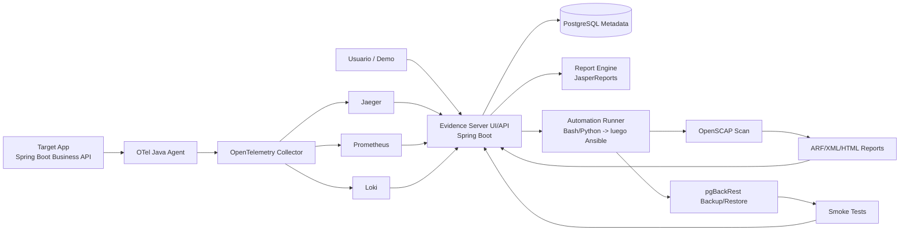
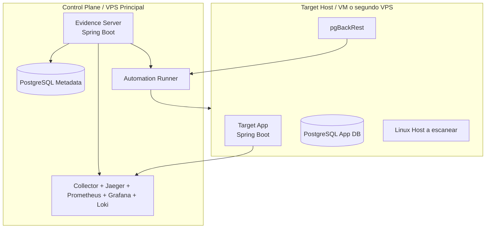
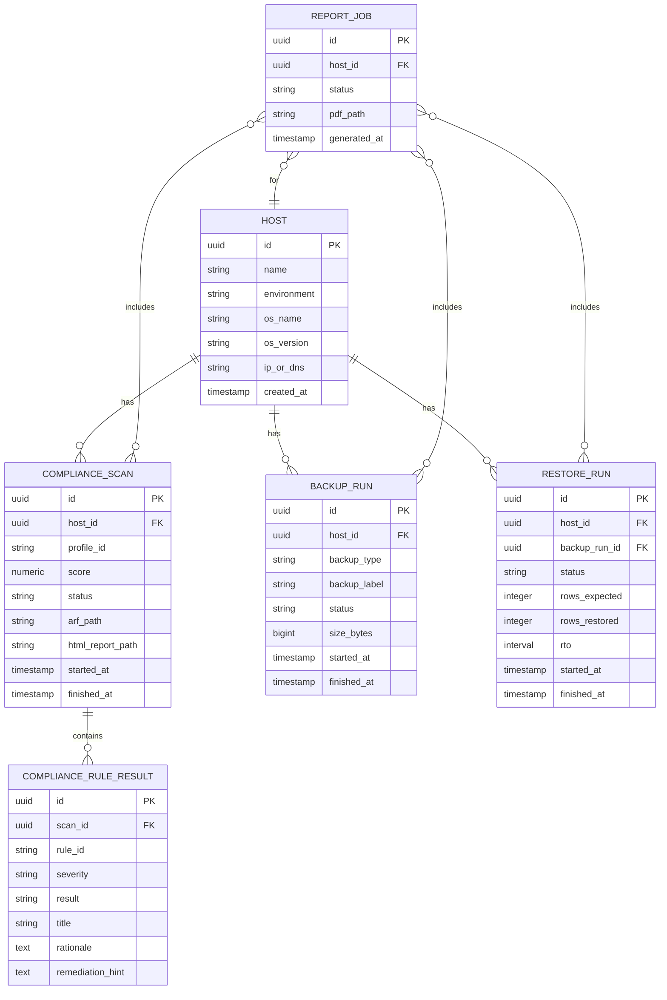
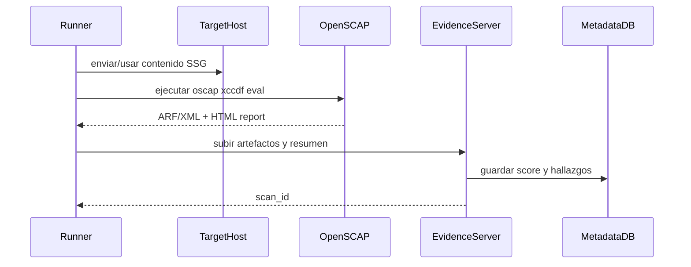
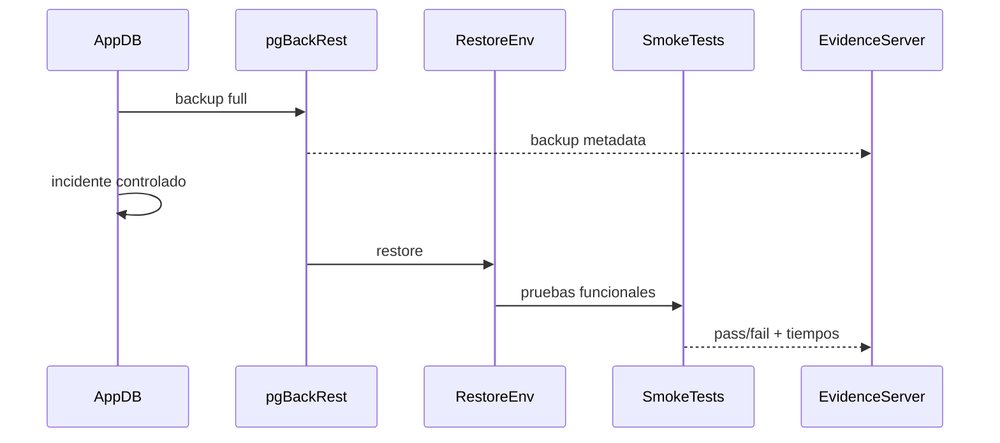
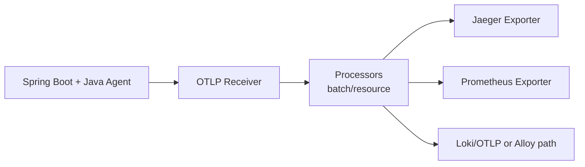
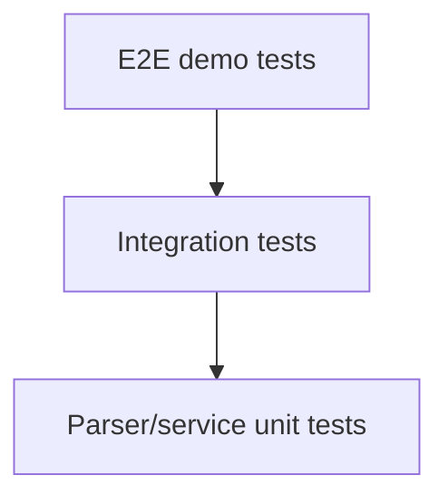

# Manual técnico — Evidence as Code para Linux

**Proyecto:** Observabilidad, cumplimiento y recuperación en Linux con software libre  
**Autor base del enfoque:** construido a partir del resumen/propuesta del proyecto y de los documentos que analizaste  
**Fecha de verificación técnica:** 2026-04-14

---

## 1) Objetivo del proyecto

Construir una plataforma libre que demuestre, con evidencia verificable, tres capacidades sobre un servicio Linux real:

1. **Observabilidad:** poder ver qué pasó en una petición, cuánto tardó y dónde falló.
2. **Cumplimiento:** poder medir si el host cumple una línea base básica de seguridad.
3. **Recuperación:** poder demostrar que la base de datos sí se recupera ante un fallo.

La idea no es “juntar herramientas”, sino crear una **plataforma de evidencia operativa** que produzca artefactos claros:

- trazas,
- métricas,
- logs,
- reportes de cumplimiento,
- historial de backups,
- pruebas de restore,
- reporte final en PDF.

---

## 2) Resultado final esperado

Al terminar el MVP, debes poder hacer esta demo:

1. Ejecutas una petición HTTP contra tu app.
2. Muestras la traza completa en Jaeger.
3. Muestras métricas en Prometheus/Grafana.
4. Muestras logs correlacionados con `trace_id`.
5. Corres un escaneo de OpenSCAP sobre el host objetivo.
6. Guardas score, reglas fallidas y reporte HTML.
7. Simulas un incidente en PostgreSQL.
8. Restauras con pgBackRest.
9. Corres smoke tests.
10. Generas un PDF de evidencia con JasperReports.

Si haces eso de forma clara, consistente y reproducible, ya tienes un proyecto que impresiona en FLISoL.

---

## 3) Decisión técnica principal

### Recomendación final para este proyecto

**Opción recomendada para aprender y entregar bien:**

- **Editor/IDE base:** VS Code
- **Asistente IA principal:** Codex o Claude Code, pero usando **uno a la vez**
- **Orquestación inicial:** Docker Compose
- **Automatización gradual:** scripts Bash/Python primero, Ansible después
- **Automatización visual opcional:** Node-RED, no como núcleo

### Por qué esta es la mejor opción

Porque reduce la carga cognitiva:

- VS Code te deja ver archivos, terminal, Git y configuración en un solo lugar.
- Docker Compose te permite levantar la plataforma completa sin entrar todavía a Kubernetes.
- Codex o Claude Code te ayudan a iterar archivos, comandos y configuraciones, pero sin que el IDE “mande” más que tú.
- Node-RED puede ayudarte a mostrar flujos visuales, pero no debe ser el corazón técnico del MVP.

### Qué NO recomiendo al inicio

- empezar con Kubernetes,
- empezar con multiagentes complejos,
- montar todo con Ansible desde el día 1,
- intentar hardening de 200 reglas,
- hacer PITR avanzado antes de tener restore básico,
- usar Promtail nuevo: ya no conviene para un proyecto nuevo.

---

## 4) Versiones recomendadas y verificadas

> **Nota importante:** fija versiones en tu repositorio y evita `latest` en producción/demo.

| Componente | Versión recomendada | Motivo |
|---|---|---|
| Spring Boot | **4.0.5** | proyecto greenfield, estable, vigente, compatible con Java 17+ |
| Java | **21** para el MVP humano; **25 LTS** si luego quieres ponerte al día con la línea más nueva | Java 21 sigue siendo una base muy compatible; Java 25 es el LTS más reciente |
| PostgreSQL | **18.3** | línea actual estable |
| OpenTelemetry Java Agent | **2.26.1** | auto-instrumentación actual |
| OpenTelemetry Collector | **v1.56.0 / v0.150.0** | release actual visible en el repositorio oficial |
| Prometheus | **3.11.2** | versión actual de descarga |
| Jaeger | **2.17.0** | versión actual de binarios/descarga |
| Grafana | **12.4** | versión actual de descarga |
| Loki | **3.7.0** | versión vigente de release notes |
| Grafana Alloy | **1.15.0** | recomendado para envío de logs; reemplaza a Promtail |
| OpenSCAP | **1.4.3** | línea actual más nueva visible en releases |
| ComplianceAsCode / content | **0.1.80** | contenido de seguridad reciente |
| pgBackRest | **2.58.0** | release estable actual |
| JasperReports Library | **7.0.6** | ya soporta Jakarta y encaja mejor con Boot 4 |
| Docker Compose | **5.1.2** | release actual |
| Node-RED | **4.1.8** | opción visual estable |
| Ansible / ansible-core | usar la línea estable actual en tu distro; introducirlo en Fase 5 o 6 | útil, pero no necesario para arrancar |

### Regla de selección técnica

- Si el componente es **núcleo del MVP**, pínchalo desde el inicio.
- Si es **opcional**, introdúcelo solo cuando el núcleo ya funcione.

---

## 5) Arquitectura recomendada

### Arquitectura lógica



### Arquitectura física recomendada para aprender sin romper todo



### Decisión operacional

**No uses el mismo host para todo en la demo final** si puedes evitarlo.

La forma más sana es:

- **Host A:** panel, observabilidad, evidencia, runner.
- **Host B:** host objetivo real con la app y la base.

¿Por qué?

- OpenSCAP toca el host real.
- pgBackRest y restore pueden alterar estado.
- Así no rompes tu stack de demo por tocar el host equivocado.

---

## 6) Stack exacto y rol de cada herramienta

### Spring Boot
Se usa dos veces:

1. **Target App:** tu aplicación de negocio de ejemplo.
2. **Evidence Server:** tu aplicación central para consolidar evidencia.

### PostgreSQL
También se usa dos veces:

1. **App DB:** datos funcionales del sistema de ejemplo.
2. **Metadata DB:** scans, backups, restores, reportes, hallazgos.

### OpenTelemetry
Captura automáticamente:

- requests HTTP,
- consultas DB,
- métricas,
- logs correlacionados.

### Collector
Es el punto central del pipeline de telemetría.

### Jaeger
Para trazas distribuidas.

### Prometheus
Para métricas temporales.

### Grafana
Para paneles bonitos y fáciles de mostrar.

### Loki + Alloy
Para logs. **Usa Alloy y no Promtail** para un proyecto nuevo.

### OpenSCAP + ComplianceAsCode
Para evaluación de cumplimiento sobre el host objetivo.

### pgBackRest
Para backup/restore de PostgreSQL.

### JasperReports
Para el PDF final de evidencia.

### Node-RED
Solo opcional, como capa visual o demo de flujo. No lo uses como cerebro central.

### Ansible
Úsalo después, cuando ya hayas probado el flujo manual con scripts.

---

## 7) Diseño del repositorio

```text
flisol-evidence-as-code/
├─ README.md
├─ docs/
│  ├─ architecture.md
│  ├─ runbook-demo.md
│  └─ decisions/
│     ├─ ADR-001-stack.md
│     ├─ ADR-002-why-compose-first.md
│     └─ ADR-003-why-alloy-not-promtail.md
├─ compose/
│  ├─ docker-compose.yml
│  ├─ docker-compose.override.yml
│  ├─ .env.example
│  ├─ collector/
│  │  └─ otel-collector-config.yaml
│  ├─ prometheus/
│  │  └─ prometheus.yml
│  ├─ grafana/
│  │  ├─ provisioning/
│  │  └─ dashboards/
│  ├─ loki/
│  │  └─ loki-config.yaml
│  └─ alloy/
│     └─ config.alloy
├─ apps/
│  ├─ target-app/
│  │  ├─ src/
│  │  ├─ pom.xml
│  │  └─ Dockerfile
│  └─ evidence-server/
│     ├─ src/
│     ├─ pom.xml
│     └─ Dockerfile
├─ automation/
│  ├─ scripts/
│  │  ├─ run_openscap.sh
│  │  ├─ parse_openscap.py
│  │  ├─ backup_db.sh
│  │  ├─ restore_db.sh
│  │  ├─ smoke_test_restore.sh
│  │  └─ collect_evidence.sh
│  ├─ ansible/
│  │  ├─ inventory.ini
│  │  ├─ playbooks/
│  │  └─ roles/
│  └─ node-red/
│     └─ flows.json
├─ reports/
│  ├─ jasper/
│  │  ├─ evidence_report.jrxml
│  │  └─ assets/
│  └─ generated/
├─ fixtures/
│  ├─ openscap/
│  ├─ pgbackrest/
│  └─ telemetry/
├─ test/
│  ├─ integration/
│  ├─ e2e/
│  ├─ smoke/
│  └─ contracts/
└─ .github/
   └─ workflows/
```

---

## 8) Modelo de datos mínimo

### Tablas sugeridas



### Regla importante

**No guardes toda la telemetría cruda en tu metadata DB.**

Guarda:

- identificadores,
- links internos,
- `trace_id` de ejemplo,
- snapshots relevantes,
- agregados,
- paths a artefactos.

La telemetría cruda vive mejor en Jaeger, Prometheus, Loki y Grafana.

---

## 9) Las 6 fases completas

# Fase 1 — Fundaciones y alcance

## Objetivo
Congelar el alcance y dejar el laboratorio reproducible.

## Qué construyes

- repositorio base,
- estructura de carpetas,
- `docker-compose.yml`,
- `.env.example`,
- dos apps Spring Boot vacías:
  - `target-app`,
  - `evidence-server`,
- dos bases PostgreSQL separadas,
- README con pasos de arranque.

## Tareas exactas

1. Crear el repositorio.
2. Definir naming del proyecto.
3. Definir variables de entorno.
4. Levantar PostgreSQL metadata y PostgreSQL app.
5. Levantar target-app y evidence-server aunque todavía respondan solo health.
6. Crear healthchecks.
7. Confirmar persistencia con volúmenes.

## Checklist de aceptación

- `docker compose up -d` levanta el sistema.
- `target-app` responde `/actuator/health`.
- `evidence-server` responde `/actuator/health`.
- ambas bases tienen credenciales externas por `.env`.
- los contenedores reinician bien.

## Entregables

- estructura inicial del repo,
- compose funcional,
- ADR de alcance,
- README mínimo.

## Métrica medible

**Tiempo de boot desde cero < 10 minutos.**

## Definition of Done

No avanzas a Fase 2 si no puedes apagar y volver a levantar todo limpio.

---

# Fase 2 — Observabilidad del servicio

## Objetivo
Ver una petición punta a punta.

## Qué construyes

- instrumentación automática del `target-app`,
- OTel Collector,
- Jaeger,
- Prometheus,
- Grafana,
- Loki + Alloy,
- endpoint demo trazable.

## Tareas exactas

1. Agregar Spring Boot Actuator al `target-app`.
2. Exponer `/actuator/health` y `/actuator/prometheus`.
3. Descargar y montar el `opentelemetry-javaagent.jar`.
4. Pasar variables OTel al contenedor Java.
5. Configurar Collector para recibir OTLP.
6. Exportar trazas a Jaeger.
7. Exportar métricas a Prometheus.
8. Enviar logs vía Alloy/Loki.
9. Crear endpoint demo que haga:
   - request,
   - lógica simple,
   - query PostgreSQL,
   - respuesta.
10. Crear un dashboard mínimo en Grafana.

## Configuración conceptual del target-app

```text
JAVA_TOOL_OPTIONS=
  -javaagent:/opt/otel/opentelemetry-javaagent.jar

OTEL_SERVICE_NAME=target-app
OTEL_EXPORTER_OTLP_ENDPOINT=http://otel-collector:4318
OTEL_TRACES_EXPORTER=otlp
OTEL_METRICS_EXPORTER=otlp
OTEL_LOGS_EXPORTER=otlp
OTEL_RESOURCE_ATTRIBUTES=service.namespace=flisol,service.version=0.1.0,deployment.environment=demo
```

## Checklist de aceptación

- Jaeger muestra trazas del endpoint demo.
- Prometheus scrapea métricas de Spring Boot.
- Grafana puede consultar Prometheus y Loki.
- cada request deja `trace_id` correlacionable.
- la consulta a PostgreSQL aparece en la traza.

## Métricas medibles

- 1 endpoint demo trazado.
- 95%+ de requests demo visibles con traza.
- latencia p95 visible.
- dashboard con al menos 4 paneles.

## Definition of Done

Debes poder mostrar un request completo sin tocar código en vivo.

---

# Fase 3 — Cumplimiento con OpenSCAP

## Objetivo
Medir seguridad básica del host con evidencia persistente.

## Qué construyes

- host objetivo escaneable,
- contenido de ComplianceAsCode,
- ejecución de `oscap xccdf eval`,
- parser de resultados,
- almacenamiento de score y fallos,
- comparación antes/después.

## Estrategia correcta para no complicarte

No empieces con 100 controles. Usa una baseline pequeña y explicable.

### Perfil mínimo sugerido del MVP

- SSH seguro,
- política básica de contraseñas,
- permisos importantes,
- servicios innecesarios,
- firewall,
- auditoría/logging básico.

## Flujo técnico



## Comando base de referencia

```bash
oscap xccdf eval \
  --profile <PROFILE_ID> \
  --results-arf /tmp/scan-results.arf.xml \
  --report /tmp/scan-report.html \
  /usr/share/xml/scap/ssg/content/<archivo-datastream>.xml
```

## Tareas exactas

1. Elegir distro objetivo.
2. Instalar OpenSCAP en el host objetivo.
3. Instalar o descargar contenido de ComplianceAsCode.
4. Identificar el archivo datastream correcto.
5. Ejecutar el primer scan manual.
6. Confirmar que se generan ARF/XML y HTML.
7. Crear parser que lea:
   - score,
   - profile_id,
   - rules fail,
   - severidad,
   - títulos.
8. Guardar resultados en la metadata DB.
9. Crear endpoint `/api/compliance/scans`.
10. Crear comparación antes/después.

## Checklist de aceptación

- se ejecuta el scan sin intervención manual compleja,
- se guarda el score,
- se guardan reglas fallidas,
- el HTML report queda asociado al scan,
- se puede listar el top 10 de hallazgos.

## Métricas medibles

- 1 host escaneado automáticamente,
- 1 perfil ejecutado con éxito,
- 1 score persistido,
- 1 reporte HTML adjunto,
- mejora demostrable después de 1 o 2 remediaciones.

## Definition of Done

Debes poder decir: “Este host tenía X hallazgos críticos y ahora tiene Y”.

---

# Fase 4 — Recuperación con pgBackRest

## Objetivo
Demostrar que PostgreSQL se puede recuperar de verdad.

## Qué construyes

- configuración base de pgBackRest,
- backup full,
- restore en entorno aislado,
- smoke tests,
- registro de RTO y consistencia.

## Diseño correcto

Empieza con **backup + restore verificado**.

No intentes PITR complejo al inicio.

### Flujo del MVP

1. Cargar datos demo.
2. Ejecutar backup.
3. Simular incidente.
4. Restaurar a contenedor aislado.
5. Correr smoke tests.
6. Registrar evidencia.

## Flujo técnico



## Comandos conceptuales

```bash
pgbackrest --stanza=appdb stanza-create
pgbackrest --stanza=appdb check
pgbackrest --stanza=appdb backup
pgbackrest info
pgbackrest --stanza=appdb restore
```

## Tareas exactas

1. Crear repositorio de backup.
2. Configurar `pgbackrest.conf`.
3. Inicializar `stanza`.
4. Hacer `check`.
5. Hacer primer backup.
6. Registrar label y duración.
7. Crear contenedor de restore aislado.
8. Ejecutar restore.
9. Correr smoke tests:
   - conexión,
   - conteo de filas,
   - query crítica,
   - health endpoint.
10. Registrar RTO.

## Checklist de aceptación

- backup exitoso,
- restore exitoso,
- smoke test aprobado,
- evidencia persistida,
- reporte del último backup disponible.

## Métricas medibles

- tiempo de backup,
- tiempo de restore,
- tamaño del backup,
- número de pruebas aprobadas,
- RTO medido,
- consistencia mínima verificada.

## Definition of Done

Debes poder borrar datos de demo, restaurar y demostrar recuperación con pruebas.

---

# Fase 5 — Evidence Server y reportes

## Objetivo
Unificar observabilidad, cumplimiento y recuperación en una sola interfaz.

## Qué construyes

- API de evidencias,
- dashboard simple,
- agregados por host,
- jobs de generación PDF,
- reporte Jasper.

## Endpoints sugeridos

- `GET /api/hosts`
- `GET /api/compliance/scans`
- `GET /api/compliance/scans/{id}`
- `GET /api/backups`
- `GET /api/restores`
- `POST /api/reports/evidence/{hostId}`
- `GET /api/reports/{id}`

## Contenido mínimo del PDF

1. Host
2. Fecha
3. Score de cumplimiento
4. Hallazgos críticos
5. Último backup válido
6. Último restore verificado
7. Tiempos RTO/RPO estimado
8. Captura o enlace a trazas relevantes
9. Conclusión ejecutiva

## Tareas exactas

1. Modelar entidades JPA.
2. Crear repositorios.
3. Crear capa de servicio.
4. Crear importadores/parsers.
5. Crear plantillas Jasper.
6. Generar PDF desde datos reales.
7. Guardar PDF en storage local o volumen.
8. Exponer descarga del reporte.

## Checklist de aceptación

- el panel lista scans,
- el panel lista backups/restores,
- el PDF se genera sin editar a mano,
- el reporte usa datos del sistema y no texto fijo,
- cada reporte queda trazable a un host y una fecha.

## Métricas medibles

- 1 PDF generado end-to-end,
- 1 dashboard navegable,
- 1 endpoint de reporte funcional,
- 100% de artefactos vinculados a una ejecución.

## Definition of Done

Debes poder entregar un PDF real después de correr el flujo.

---

# Fase 6 — End-to-end, endurecimiento y demostración

## Objetivo
Congelar una versión estable, con pruebas y narrativa de demo.

## Qué construyes

- pruebas de integración,
- pruebas E2E,
- dataset demo,
- runbook de presentación,
- scripts de “demo day”,
- versión congelada.

## Tareas exactas

1. Crear dataset demo repetible.
2. Crear script `seed_demo_data.sh`.
3. Crear script `demo_run.sh`.
4. Crear script `reset_demo.sh`.
5. Ensayar demo completa.
6. Medir tiempos reales.
7. Reducir pasos manuales.
8. Documentar fallos conocidos.
9. Congelar tags/versions.
10. Ensayar dos veces sin tocar código.

## Checklist de aceptación

- demo completa en < 7 minutos,
- arranque reproducible,
- evidencia generada sin intervención manual excesiva,
- logs entendibles,
- contingencia documentada.

## Métricas medibles

- tiempo real de demo,
- número de comandos manuales,
- número de fallos por ensayo,
- tiempo de recuperación del entorno.

## Definition of Done

No cambias dependencias ni arquitectura 48 horas antes del evento.

---

## 10) Orden exacto de implementación

### Semana / Sprint corto recomendado

1. Fase 1 completa.
2. Fase 2 completa.
3. Fase 3 manual primero, luego automatizada.
4. Fase 4 manual primero, luego automatizada.
5. Fase 5 para consolidar.
6. Fase 6 para estabilizar.

### Regla de oro

**Manual primero, automatizado después.**

Si no puedes correr un scan o un restore manualmente, no intentes automatizarlo todavía.

---

## 11) Qué hacer exactamente en cada componente

# 11.1 Target App

### Qué debe hacer

- exponer un endpoint sencillo,
- hablar con PostgreSQL,
- tener Actuator,
- responder health,
- emitir telemetría automática.

### Endpoint recomendado

`POST /api/orders/demo`

Debe:

- insertar un registro,
- consultar un total,
- devolver respuesta con tiempo y `trace_id`.

### Dependencias mínimas

- spring-boot-starter-web
- spring-boot-starter-actuator
- spring-boot-starter-data-jpa
- PostgreSQL driver
- micrometer-registry-prometheus

### Buenas prácticas

- logs JSON o al menos estructurados,
- correlation id,
- manejo simple de errores,
- DTOs mínimos.

---

# 11.2 Evidence Server

### Qué debe hacer

- guardar resultados,
- mostrar historial,
- generar reportes,
- exponer APIs para scans/backups/restores.

### No debe hacer

- almacenar series temporales completas,
- reemplazar a Prometheus,
- reemplazar a Jaeger,
- reemplazar a Loki.

### Rol correcto

Ser el **sistema de evidencia**, no el sistema de telemetría cruda.

---

# 11.3 OTel Collector

### Qué debe hacer

- recibir OTLP,
- enrutar trazas,
- enrutar métricas,
- enrutar logs,
- centralizar configuración.

### Pipeline recomendado



### Procesadores recomendados

- `batch`
- `resource`
- `memory_limiter`

---

# 11.4 OpenSCAP

### Qué debe hacer

- correr sobre el host objetivo,
- devolver ARF/XML,
- devolver HTML,
- permitir comparación histórica.

### Qué NO debes hacer al inicio

- remediar automáticamente todo,
- tocar el host de demo principal,
- correr perfiles enormes sin entenderlos.

### Patrón correcto

1. scan manual,
2. parser,
3. persistencia,
4. remediación pequeña,
5. rescan.

---

# 11.5 pgBackRest

### Qué debe hacer

- crear backup,
- listar backups,
- restaurar,
- dejar evidencia de que restauró.

### Qué NO debes vender

No digas “tenemos DR” si solo hiciste backup.

Debes vender:

**“Tenemos backup verificado por restore y smoke tests.”**

---

## 12) Plan de pruebas de integración

### Pirámide recomendada



### Unit tests

Prueba:

- parser de OpenSCAP,
- parser de pgBackRest info,
- generador de report DTO,
- lógica de score.

### Integration tests

Prueba:

- persistence JPA,
- endpoints REST,
- generación Jasper,
- importación de artefactos reales o fixtures.

### E2E tests

Prueba:

- levantar stack,
- generar request,
- verificar traza,
- correr scan,
- correr backup,
- correr restore,
- generar PDF.

### Herramientas sugeridas

- JUnit 5
- Testcontainers
- RestAssured
- scripts Bash para smoke e2e

### Matriz mínima de validación

| Caso | Resultado esperado |
|---|---|
| request demo | traza visible |
| `/actuator/prometheus` | scrape exitoso |
| scan OpenSCAP | score y HTML persistidos |
| backup pgBackRest | status success |
| restore pgBackRest | smoke test pass |
| reporte Jasper | PDF generado |

---

## 13) Contratos de integración entre módulos

Para que luego unir cosas no sea difícil, define contratos simples.

### Contrato 1 — Compliance

**Entrada:** host, profile, timestamp  
**Salida:**

```json
{
  "host": "target-01",
  "profile": "baseline",
  "score": 74.5,
  "failedRules": 8,
  "criticalRules": 2,
  "reportPath": "/artifacts/compliance/report.html",
  "arfPath": "/artifacts/compliance/result.arf.xml"
}
```

### Contrato 2 — Backup

```json
{
  "host": "target-01",
  "backupLabel": "20260414-010203F",
  "type": "full",
  "status": "success",
  "startedAt": "...",
  "finishedAt": "..."
}
```

### Contrato 3 — Restore

```json
{
  "host": "target-01",
  "backupLabel": "20260414-010203F",
  "status": "success",
  "rtoSeconds": 95,
  "checks": [
    {"name": "db-connect", "status": "pass"},
    {"name": "row-count", "status": "pass"},
    {"name": "critical-query", "status": "pass"}
  ]
}
```

### Contrato 4 — Reporte final

```json
{
  "host": "target-01",
  "generatedAt": "...",
  "complianceScore": 74.5,
  "latestBackup": "20260414-010203F",
  "latestRestoreStatus": "success",
  "pdfPath": "/reports/evidence-target-01.pdf"
}
```

Si mantienes estos contratos estables, luego podrás reemplazar scripts por Ansible o Node-RED sin reventar todo.

---

## 14) Secuencia de comandos recomendada

### Día de trabajo normal

1. `docker compose up -d`
2. seed demo data
3. request demo
4. verificar observabilidad
5. correr scan compliance
6. correr backup
7. correr restore
8. generar reporte

### Pseudosecuencia

```bash
./automation/scripts/seed_demo_data.sh
./automation/scripts/call_demo_endpoint.sh
./automation/scripts/run_openscap.sh
./automation/scripts/parse_openscap.py
./automation/scripts/backup_db.sh
./automation/scripts/restore_db.sh
./automation/scripts/smoke_test_restore.sh
./automation/scripts/collect_evidence.sh
```

---

## 15) Estrategia de evolución futura

Cuando el MVP funcione, la evolución correcta es esta:

### Etapa 1
Scripts Bash/Python + Compose.

### Etapa 2
Ansible para:

- inventarios,
- ejecución remota,
- remediaciones pequeñas,
- jobs repetibles.

### Etapa 3
Node-RED solo si quieres visualización de flujos o demo educativa.

### Etapa 4
OpenTofu o Terraform-compatible si luego quieres reprovisionar infraestructura.

### Etapa 5
CI/CD con GitHub Actions o similar.

### Etapa 6
Más hosts, más perfiles, más dashboards, más automatización.

---

## 16) Riesgos reales y mitigación

| Riesgo | Qué pasa | Mitigación |
|---|---|---|
| Scope creep | nunca terminas | congelar MVP |
| mezclar todo en un host | se rompe la demo | separar control plane y target |
| OpenSCAP demasiado grande | te ahogas en perfiles | empezar con baseline mínima |
| restore demasiado ambicioso | no llegas | backup+restore verificado primero |
| UI compleja | pierdes tiempo | dashboard simple |
| cambiar versiones tarde | demo inestable | freeze 48h antes |
| varias IAs a la vez | confusión | una IA principal por sesión |

---

## 17) Mejor forma de trabajar con IA para aprender de verdad

### Recomendación humana

Usa esta combinación:

- **VS Code** como espacio principal,
- **Codex o Claude Code** como copiloto técnico,
- terminal visible siempre,
- Git desde el día 1,
- tú tomando las decisiones.

### Por qué

Porque aprender no es dejar que la IA haga todo. Aprender es:

- pedirle estructura,
- pedirle comandos,
- pedirle explicación,
- pedirle pruebas,
- validar tú el resultado.

### Regla práctica

No le digas a la IA “hazme todo”. Dile:

- “créame este archivo”,
- “explícame esta configuración”,
- “dame el siguiente paso mínimo”,
- “genera una prueba”,
- “compara este resultado esperado con el real”.

---

## 18) Prompts listos para Codex / VS Code / Claude Code

### Prompt 1 — Inicializar repo

```text
Quiero que prepares la estructura mínima de un proyecto llamado flisol-evidence-as-code.
Usa dos apps Spring Boot: target-app y evidence-server.
Crea además la carpeta compose con docker-compose.yml y placeholders para collector, prometheus, grafana, loki y alloy.
No inventes arquitectura extra. Solo crea la estructura mínima y comenta cada decisión.
```

### Prompt 2 — Observabilidad

```text
Quiero instrumentar target-app con OpenTelemetry Java agent.
Estoy usando Spring Boot 4, PostgreSQL y Docker Compose.
Necesito:
1) variables de entorno exactas,
2) collector config mínima,
3) prometheus scrape config,
4) cómo verificar Jaeger,
5) cómo verificar /actuator/prometheus.
No uses Kubernetes. Todo debe correr en Compose.
```

### Prompt 3 — OpenSCAP

```text
Quiero automatizar un escaneo OpenSCAP sobre un host Linux objetivo.
Necesito un script run_openscap.sh y un parser parse_openscap.py.
El script debe generar ARF/XML y HTML report.
El parser debe extraer score, reglas fallidas, severidad, título y rutas de artefactos.
Devuélveme archivos concretos, comentarios y supuestos explícitos.
```

### Prompt 4 — pgBackRest

```text
Quiero configurar pgBackRest para una base PostgreSQL en Docker.
Necesito una configuración mínima funcional para backup y restore en un entorno demo.
Dame:
1) ejemplo de pgbackrest.conf,
2) comandos stanza-create, check, backup, info, restore,
3) script smoke_test_restore.sh,
4) validaciones concretas post-restore.
```

### Prompt 5 — Evidence Server

```text
Quiero una app Spring Boot llamada evidence-server.
Debe exponer APIs para hosts, scans, backups, restores y report jobs.
Usa PostgreSQL y JPA.
Empieza por el modelo de datos, luego endpoints REST, luego servicios.
No generes frontend complejo todavía.
```

### Prompt 6 — JasperReports

```text
Quiero generar un PDF de evidencia con JasperReports 7.
Estoy en Spring Boot 4.
Necesito un .jrxml sencillo que muestre: host, fecha, compliance score, hallazgos críticos, último backup, último restore y conclusión.
Genera el template y el código Java mínimo para llenarlo.
```

### Prompt 7 — pruebas

```text
Quiero una estrategia de pruebas para este proyecto Evidence as Code.
Usa JUnit 5 y Testcontainers donde convenga.
Sepáralo en unit, integration y e2e.
Dame ejemplos concretos de casos de prueba y prioridades.
```

---

## 19) Qué debes mostrar en FLISoL para impresionar

No necesitas enseñar 500 pantallas. Enseña esto:

1. **Problema real:** “muchos equipos no pueden probar que observan, cumplen y recuperan”.
2. **Arquitectura simple:** 2 hosts, 1 app, 1 plataforma de evidencia.
3. **Observabilidad:** una traza viva.
4. **Cumplimiento:** score antes/después.
5. **Recuperación:** backup verificado por restore.
6. **Reporte final:** PDF generado automáticamente.
7. **Mensaje final:** “todo con software libre y reproducible”.

### Narrativa fuerte

> “No solo monitoreé un servicio. Construí una plataforma libre que genera evidencia operativa: demuestra trazabilidad, postura de seguridad y capacidad de recuperación sobre Linux.”

Eso suena serio, técnico y útil.

---

## 20) Plan de estudio personal recomendado

### Orden para aprender

1. Docker Compose
2. Spring Boot Actuator
3. OpenTelemetry Java agent
4. Collector + Jaeger + Prometheus
5. Loki + Alloy
6. OpenSCAP
7. pgBackRest
8. JasperReports
9. Ansible
10. Node-RED opcional

### Por qué este orden

Porque vas de:

- más visible,
- más verificable,
- menos riesgoso,
- a más potente.

---

## 21) Recomendación final de arquitectura y método

### Si tu prioridad es **entender y aprender**

Haz esto:

- VS Code
- Compose
- Spring Boot 4
- Java 21
- PostgreSQL 18.3
- OTel + Jaeger + Prometheus + Grafana + Loki/Alloy
- OpenSCAP
- pgBackRest
- JasperReports
- scripts Bash/Python

### Si tu prioridad es **verse más enterprise** después

Agrega luego:

- Ansible,
- OpenTofu,
- pipelines CI,
- inventario multi-host,
- dashboards más completos,
- más perfiles de compliance.

### Conclusión técnica

La mejor opción para ti **como humano que quiere aprender** y además **entregar algo que impresione** es:

- **VS Code como base**,
- **Codex o Claude Code como asistente**,
- **Docker Compose como plataforma de laboratorio**,
- **un MVP de dos hosts**,
- **observabilidad + compliance + restore verificado**,
- **reportes como diferenciador**.

Eso te da aprendizaje real, demo clara y una base escalable.

---

## 22) Fuentes verificadas

### Stack principal
- Spring Boot project page: https://spring.io/projects/spring-boot
- Spring Boot system requirements: https://docs.spring.io/spring-boot/system-requirements.html
- PostgreSQL releases: https://www.postgresql.org/docs/release/
- PostgreSQL current docs: https://www.postgresql.org/docs/current/index.html
- PostgreSQL backup and PITR docs: https://www.postgresql.org/docs/current/backup.html
- PostgreSQL continuous archiving / PITR: https://www.postgresql.org/docs/current/continuous-archiving.html
- OpenTelemetry Java agent docs: https://opentelemetry.io/docs/zero-code/java/agent/
- OpenTelemetry Collector docs: https://opentelemetry.io/docs/collector/
- OTel Collector releases: https://github.com/open-telemetry/opentelemetry-collector/releases
- Prometheus download page: https://prometheus.io/download/
- Jaeger download page: https://www.jaegertracing.io/download/
- Grafana download page: https://grafana.com/grafana/download
- Loki release notes: https://grafana.com/docs/loki/latest/release-notes/
- Promtail EOL notice: https://grafana.com/docs/loki/latest/send-data/promtail/
- Grafana Alloy release notes: https://grafana.com/docs/alloy/latest/release-notes/

### Compliance
- OpenSCAP portal: https://www.open-scap.org/
- OpenSCAP releases: https://github.com/OpenSCAP/openscap/releases
- OpenSCAP user manual: https://static.open-scap.org/openscap-1.3/oscap_user_manual.html
- ComplianceAsCode/content releases: https://github.com/ComplianceAsCode/content/releases
- ComplianceAsCode install docs: https://complianceascode.readthedocs.io/en/latest/manual/user/10_install.html

### Backups y reporting
- pgBackRest home: https://pgbackrest.org/
- pgBackRest user guide: https://pgbackrest.org/user-guide.html
- pgBackRest command reference: https://pgbackrest.org/command.html
- JasperReports community edition: https://community.jaspersoft.com/files/file/138-jasperreports-library/
- JasperReports releases: https://github.com/Jaspersoft/jasperreports/releases

### IDE y asistentes
- VS Code AI features: https://code.visualstudio.com/docs/copilot/concepts/overview
- Codex IDE extension: https://developers.openai.com/codex/ide
- Claude Code overview: https://code.claude.com/docs
- Node-RED home: https://nodered.org/

---

## 23) Nota final

Si quieres seguir bien este manual, trabaja siempre con esta regla:

**cada fase debe dejar evidencia ejecutable**.

No avances por intuición. Avanza por artefactos:

- contenedor arriba,
- endpoint vivo,
- traza visible,
- scan persistido,
- backup realizado,
- restore validado,
- PDF generado.

Cuando tengas eso, ya no estás “aprendiendo herramientas sueltas”. Ya estás construyendo una solución DevOps real.
